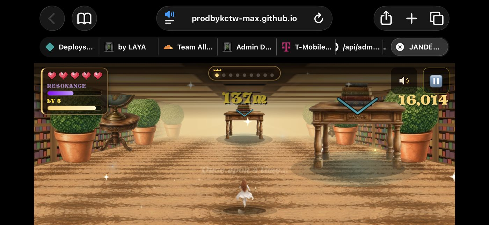
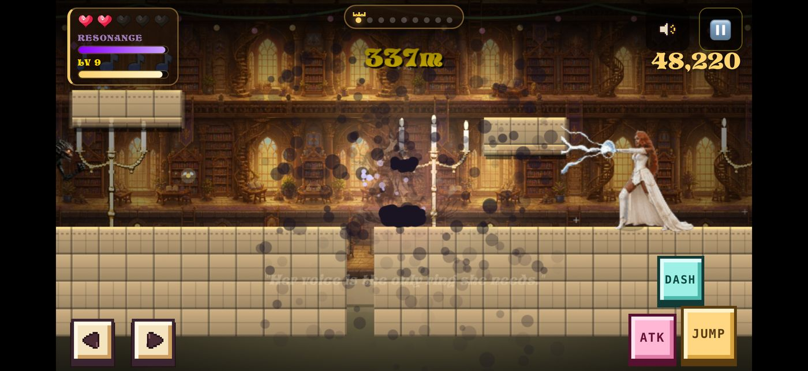
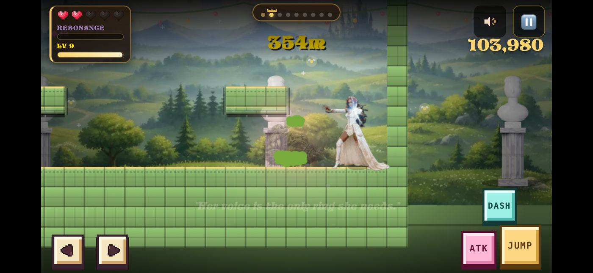
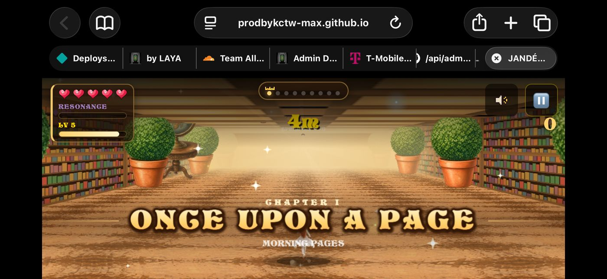
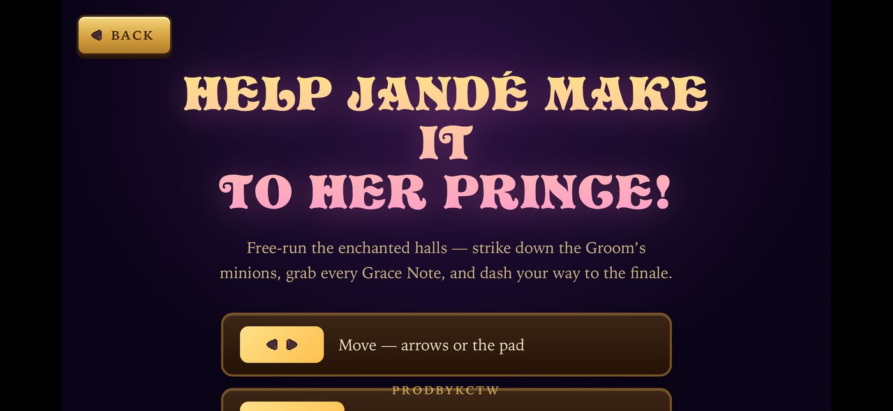
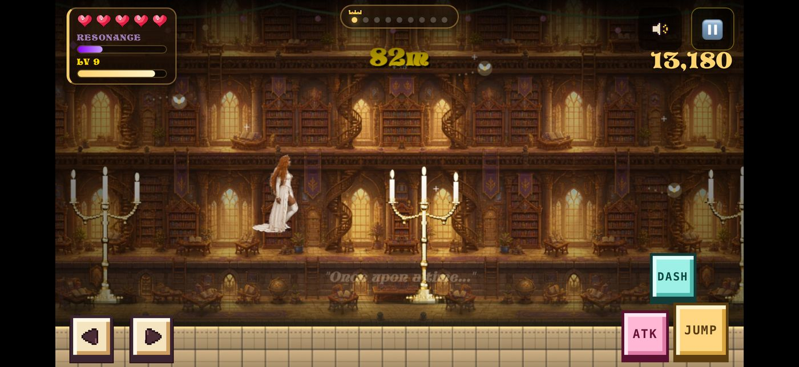

# LANDSCAPE IS BROKEN — fix brief for the laptop session

**Reported by the client, 2026-07-26, on device (iPhone, iOS Safari, landscape).**
Screenshots are in `docs/landscape/`. Client's words: *"This is how horrible
everything looks sideways."*

Portrait is fine. **Everything below is landscape-only** (plus #0b, which also
hits any large desktop window). Twelve issues.

**#0, #0b, #0c and #1 are root-caused down to the line** — those four are what
make the game feel broken, and they are four *independent* bugs. The rest
(#2–#8) are clipping/overflow and cosmetics.

They share one underlying mistake, which is why they all surfaced at once when
the phone was turned sideways: **a quantity that should scale with the world (or
with the hero) is pinned to a raw screen dimension instead.** Portrait hides all
four because `W < H` there.

---

## 0. Décor props sink under the floor / fly up when you jump 🔴🔴 ROOT CAUSE

> Client: *"the statues and candles are under the floor, and then when you jump
> they're in the air — nothing is sized properly for the horizontal version."*

This one is provable by inspection, and it explains both halves of that sentence.

**The backdrop is drawn in screen space; the world is drawn scaled by `ZOOM`.
They are never reconciled.** In `draw()` (~line 3709):

```js
drawMansionBG(st);                                   // screen-space, NO zoom
FX.save(); FX.scale(ZOOM,ZOOM); FX.translate(-GS.camX,-GS.camY);   // world
```

And inside `drawMansionBG` (line 3502):

```js
var floorY  = H*0.82;
var groundY = Math.min(floorY, 14*32-(GS.camY||0));   // ← missing  * ZOOM
```

The décor props (statues, candelabras) are then planted on `groundY` (line 3609).

**Where the floor actually renders:** `(FLOOR_R*T - camY) * ZOOM`
**Where the props are planted:** `FLOOR_R*T - camY` (no `* ZOOM`)

These agree **only if `ZOOM === 1`** — and in side mode `ZOOM` is clamped to
`[0.5, 0.78]` and is *never* 1 (line 826-828). So:

1. **"Under the floor."** The prop baseline is computed at 1.0 scale while the
   world renders at 0.645–0.78, so the props' ground line lands at a different
   screen row than the real floor. They sit buried or hover.
2. **"In the air when you jump."** `groundY` tracks `camY` at rate **1.0**; the
   world floor tracks it at rate **ZOOM (0.78)**. Jumping changes `camY`, and the
   two move at *different speeds* — so the props visibly swim relative to the
   ground. This is a drift bug, not a constant offset.
3. **"Nothing is sized properly sideways."** The prop draw constants are fixed
   **screen** pixels — `propSp=340`, `dh2=176`, `dw2=106`, `plant=176*14/240+2`
   (lines 3599–3609). They don't scale with `ZOOM`, so at 0.78 (landscape) vs
   0.645 (portrait) the props are the wrong size *relative to the world* in each
   orientation — and the spacing between them drifts too.

**Why it looks worse in landscape:** the `Math.min(floorY, …)` clamp partly hides
it when `H` is tall. Portrait `H≈932 → floorY≈764`; landscape `H≈430 →
floorY≈353`. The much lower clamp in landscape changes which branch wins and how
often, so the mismatch is exposed far more of the time.

**Fix direction**
- Multiply the baseline by the world scale: `groundY = (FLOOR_R*T - camY) * ZOOM`
  (use `FLOOR_R`, not the hard-coded `14`).
- Scale the prop geometry by `ZOOM` too (`dh2`, `dw2`, `plant`, `propSp`) so props
  keep a constant *world* size in both orientations.
- Or cleaner: draw the décor band **inside** the world transform with the other
  world objects, and let the existing `scale/translate` handle it — then the
  parallax factor is the only thing that needs separate treatment.

Verify by jumping on `?stage=0`: prop bases must stay welded to the floor line
through the whole arc, in **both** orientations.

**Note:** issue #1 below (the giant ground slab) is a *separate* framing bug —
fixing #0 will not fix #1, and vice-versa. Both need doing.

---

## 0b. RUNNER: obstacles balloon in landscape / on any larger screen 🔴🔴

> Client: *"the arches are so high you wouldn't even think you have to roll under
> them"* … *"obstacles gain size greatly on any larger screen."*



**Obstacles are sized off viewport WIDTH while the hero is sized off HEIGHT.**

```js
var laneW = W*0.185;                                        // line 2350 — width
var obW   = Math.max(laneW, H*0.125)*1.1;                   // line 2620 — hazard basis
...
var figH  = H*0.34;                                         // line 4626 — hero, height
```

The `Math.max(laneW, H*0.125)` guard was added to stop obstacles being *starved in
portrait* (narrow `W` ⇒ small `laneW`). It works there — but it has no upper
bound, so as soon as `W > H` the `laneW` term wins and grows with the screen:

| viewport | laneW | H*0.125 | **obW** | hero figH | **obW / figH** |
|---|---|---|---|---|---|
| portrait 430×932 | 79.6 | 116.5 | **128** | 317 | **0.40** |
| landscape 932×430 | 172.4 | 53.8 | **190** | 146 | **1.30** |
| desktop 1920×1080 | 355 | 135 | **391** | 367 | **1.06** |

So an obstacle is **0.40× the hero's height in portrait but 1.30× in landscape —
3.3× larger relative to the character.** That is precisely why a roll-under arch
stops reading as something you duck under: it towers over her instead of sitting
at chest height. Same mechanism on a big desktop window.

**Fix direction:** size hazards from the **same basis as the hero** so the
affordance is a constant fraction of the character in every orientation — e.g.
derive `obW` from `figH`, or clamp the width term:
`obW = Math.min(laneW, H*0.125*1.4)*1.1`. Keep the portrait floor (that guard is
doing real work); just add the ceiling it never had.

**Verify:** a roll-under gate should occupy the same fraction of Jandé's height in
portrait, landscape, and a maximized desktop window.

---

## 0c. RPG: seam lines still appear between backdrop layers while scrolling 🔴

> Client: *"there are still lines when you move between the layers of the
> background on the RPG."*

The wall band was fixed for this and the painted backdrop was **not**. Compare —
wall band (line 3563, correct):

```js
var x0=Math.round(wx), x1=Math.round(wx+wW2), tw=x1-x0;   // shared integer edges
FX.drawImage(TEX.walls, …, x0, wTop, tw, wBandH);
```

Painted backdrop (line 3539-3543, **still fractional**):

```js
var bh=Math.max(groundY+40,H*0.94), bw=bh*(_bg.width/_bg.height), by=groundY+30-bh;
var boff=(-cam*0.045)%(bw*2); if(boff>0)boff-=bw*2;
for(var bx=boff; bx<W+bw; bx+=bw){        // bx and bw both fractional
  … FX.drawImage(_bg, bx, by, bw, bh);    // ← no rounding, edges don't meet
}
```

`bw` is a float and `bx` accumulates floats, so each tile is drawn at a fractional
x with fractional width. Adjacent tiles don't share an exact edge → a **1px
gap/seam that scrolls across the screen** — the same bug class already solved for
the walls. Apply the identical snap: round each tile's left and right edge and
derive the width from the difference (`tw = x1 - x0`), never from `bw` directly.

**Also:** the mirror parity here is `Math.round((bx-boff)/bw)%2` — an index
relative to `boff`, which itself wraps. The wall band deliberately keys parity to
a *stable world index* (`Math.round((wx+cam*0.35)/wW2)`) so tiles never flip-flash
when the offset wraps. The backdrop should do the same.

---

## 1. RPG: a giant flat slab of ground eats ~40% of the screen 🔴 WORST




The floor line sits ~61% down the screen and everything below it is one
featureless tiled slab. The actual playfield is squeezed into a thin strip at the
top, and the beautiful painted backdrop is mostly hidden behind the slab.

**Root cause — it's a fixed *world-space* margin under the floor, and that's the
bug.** In `resize()` (index.html ~line 812):

```js
if(MODE==='side'){
  var BASE=0.78, VIEW_W=520, VIEW_H=320;
  ZOOM=Math.min(BASE, W/VIEW_W*BASE, H/VIEW_H*BASE);
  ZOOM=Math.max(0.5,ZOOM);
}
VW=W/ZOOM; VH=H/ZOOM;
```

On this device:
| | W×H (CSS px) | ZOOM | **VH (world px visible)** |
|---|---|---|---|
| portrait | ~430×932 | 0.645 | **1445** (~45 tiles) |
| landscape | ~932×430 | 0.78 (BASE cap) | **551** (~17 tiles) |

The camera keeps roughly the same *world-space* distance below the floor in both
orientations — about 6–7 tiles. That's **15% of a portrait screen but 39% of a
landscape screen.** Same world margin, wildly different screen fraction.

**Fix direction:** make the floor line land at a consistent *fraction* of the
viewport instead of a fixed world offset — clamp the camera so the ground surface
sits at ~78–82% of viewport height in both orientations. Equivalently, cap the
below-floor margin to a share of `VH` rather than a constant. Don't just crank
`BASE`; that shrinks the hero without fixing the ratio.

> ⚠ Whatever you change, route it through **`setZoom()`** — never assign `ZOOM`
> directly (your own July 25 rule, `BASEZ` + `setZoom()`).

---

## 2. RPG: blank untextured slabs + a tile column running into the sky 🔴


- **Blank white/cream rectangles** float in the library scene (top-left, and
  mid-screen right of the candelabra). They're platforms drawing with no usable
  texture — they read as debug boxes, not level geometry.
- **In the meadow shot (#07), a solid column of ground tiles runs floor→sky** at
  roughly 2/3 across, and the painted backdrop visibly **ends with a hard vertical
  seam** at that same x. Backdrop and geometry disagree about where the world ends.

Both probably surface only in landscape because the wider `VW` (1195 world px vs
667 portrait) streams in columns portrait never reveals on screen.

---

## 3. Runner + RPG: iOS Safari chrome steals ~28% of the height




In landscape Safari shows the URL bar **and** the bookmarks/tab strip — about 250
of 1179 device px. The game is letterboxed into what's left and the bottom of the
scene is cut. In #08 Jandé is half out of frame behind the chapter card.

`html,body,#gameWrap` already use `100dvh` (line 43/115), so the *canvas* is
sized right — the problem is the **world layout inside** it assumes a taller box.
Worth also confirming `viewport-fit=cover` + `env(safe-area-inset-*)` are honored
in landscape, where the insets are left/right, not just top/bottom.

---

## 4. Game over: the action buttons are below the fold


RUN OVER shows the score and the leaderboard name/SAVE, but CONTINUE / RESTART /
MAIN MENU are cut off at the bottom edge — the player has to know to scroll.
`#overlay` (line 199) has `overflow-y:auto`, so it *scrolls*, but nothing signals
that. In a short landscape box the primary actions must be reachable without
scrolling: tighten vertical rhythm under `(orientation:landscape)`, or make the
button row a sticky footer inside the overlay.

---

## 5. Registration card is clipped at the top


"Enter the Kingdom" is cut off by the top edge — the card is taller than the
landscape viewport and starts above y=0. Same class of fix as #4 (the how-to
screen at line 211 already got `justify-content:flex-start` + `overflow-y:auto` +
top padding; the register card needs the same treatment).

---

## 6. How-to: the PRODBYKCTW footer sits on top of the content



`.site-footer` is `position:absolute; bottom:12px` (line 351) — in landscape it
lands **on top of** the second control card, and the card list is cut off below.
The Back-button-vs-title fix worked (title is clear now), but the footer needs to
either flow with the scroll content or be hidden under
`(orientation:landscape) and (max-height:560px)`.

---

## 7. Title screen: a vertical seam splits the background


A hard vertical edge runs top-to-bottom at ~52% — the left half is lighter purple,
the right half nearly black. Reads as two mismatched panels, not one backdrop.
Likely the same backdrop-tiling seam class as #2.

---

## 8. Control cluster is fine — but verify hit targets



Good news: **the landscape controls all fit on screen** (left/right pads bottom-left,
DASH above ATK/JUMP bottom-right) — that closes the long-standing "verify landscape
controls on device" item. The existing rule at line 282 is doing its job:

```css
@media (orientation:landscape) and (max-height:560px){
  body.mobile .mdiam{--ak:clamp(52px,15vh,72px)}
  body.mobile .dpad{--dk:clamp(40px,11.5vh,56px)}
}
```
Only thing to check: at `15vh` on a 430px-tall landscape viewport the action keys
compute to ~64px, but the d-pad at `11.5vh` ≈ 49px — **under Apple's 56px minimum
touch target.** Consider raising the d-pad floor.

---

## 9. HUD is clean

No overlap between the RESONANCE/LV panel, the crown progress ribbon, and the
sound/pause buttons in landscape. Nothing to do — noting it so it doesn't get
"fixed" by accident.

---

## Suggested order
All four root-caused items are **independent bugs** — none of the fixes resolves
another, so all four need doing.

1. **#0 décor baseline missing `* ZOOM`** — the props-under-the-floor /
   flying-on-jump bug. Smallest diff, most obviously "broken" to a player.
2. **#0b runner hazard scale** — one-line clamp; restores the roll-under
   affordance in landscape *and* on desktop.
3. **#1 camera/ground ratio** — biggest visual win, makes the painted backdrops
   actually visible instead of hidden behind the slab.
4. **#0c backdrop tile rounding** — reuse the wall-band snap that already exists
   ten lines away.
5. **#2 blank platforms + tile column** — reads as broken geometry.
6. **#4/#5/#6 overlay & footer clipping** — pure CSS under the existing
   `(orientation:landscape)` query.
7. **#7 title seam**, **#8 d-pad target size**.

### The through-line
Four of these are the same mistake in different places: **a quantity that should
scale with the world (or with the hero) is instead pinned to a raw screen
dimension.** `groundY` forgets `ZOOM`; prop geometry is fixed screen px; `obW`
follows `W` while the hero follows `H`; backdrop tiles use unrounded float
widths. Portrait accidentally hides all four because `W < H` there. Anything that
sizes gameplay art should key off the hero/world scale, not off `W` or `H`
directly — worth a grep for other `H*` / `W*` constants in the draw paths.

## Verifying
Portrait must not regress. Repro at ~932×430 CSS px with `body.mobile` active;
`?stage=0` (library) and `?stage=1` (meadow) reproduce #1 and #2 immediately. Note
the known limit: with the preview pane hidden `requestAnimationFrame` throttles —
use the iframe harness from your July 25 note.

---

# FOLLOW-UP 2026-07-26 (after the fixes deployed)

Client re-tested on device against the live build (deployed 12:39). Verified the
fixes are genuinely live: `groundY … * _wz` and `obW = H*0.125*1.1` are both
present in the deployed `index.html`, and the screenshots confirm the ground slab
is gone and the décor now plants on the floor. **#0, #0b, #1 confirmed fixed on
device.**

## ⚠️ One fix was landscape-gated and shouldn't have been

**`.site-footer` still overlaps content in PORTRAIT.** On the how-to screen the
`PRODBYKCTW` footer sits **on top of the THE BOUTIQUE button** — client
screenshot, portrait, iPhone.

Cause: the fix is

```css
@media (orientation:landscape) and (max-height:560px){   /* line 298 */
  …
  .site-footer{display:none}                            /* line 309 */
}
```

so it only applies in **landscape**. In portrait `.site-footer` is still
`position:absolute; bottom:12px; z-index:6` (line 373) and floats over whatever
the scrolling content ends on. Portrait is the *primary* orientation, so this is
the more important of the two.

**Fix:** don't gate it on orientation. Either let the footer flow with the
scroll content on `#howToScreen` (it's `overflow-y:auto` already), or hide it
whenever the content would reach it — the orientation isn't what determines the
collision, the content height is.

## Not bugs — for the record
- **iOS Safari chrome still eats ~28% of the landscape viewport.** That's browser
  UI; no CSS removes it. **Add to Home Screen** launches the PWA standalone
  (`apple-mobile-web-app-capable` is already set) and it disappears. Worth a
  one-line hint on the title screen rather than an engine change.
- **Glyphs still visible** (`✦ THE BOUTIQUE`, the Grace Notes chip): expected —
  `docs/GLYPH_SWEEP.md` was only filed today and hasn't been implemented.

## 🔴 #0 IS NOT FULLY FIXED — the `Math.min(floorY, …)` clamp now causes it

> Client, after the deploy: *"when I jump horizontally on the first stage, the
> shit is locked to the background floor, but it's not locked to the stage floor."*

That is a precise description of what the code now does. The `* _wz` half of the
fix is correct and landed. **The clamp that was left in front of it is now the
bug.** Live line 3555:

```js
var floorY  = H*0.82;                                        // FIXED screen row
var groundY = Math.min(floorY, (FLOOR_R*T-(GS.camY||0))*_wz);
```

`floorY` is a **fixed fraction of the screen** — it does not move with the
camera. So whenever the scaled world floor would fall *below* `H*0.82`, `groundY`
stops tracking the camera and **pins to a static screen row**. The décor props,
which anchor to `groundY`, freeze with it while the real stage floor keeps
scrolling — props welded to the backdrop, detached from the stage. Exactly as
described.

**Simulated with the live constants:**

| | camY | `(FLOOR_R*T−camY)*ZOOM` | `groundY` | tracking? |
|---|---|---|---|---|
| **LANDSCAPE** H=430, ZOOM=0.78, floorY=**353** | 40 | 318 | 318 | yes |
| | 0 *(at rest)* | **349** | 349 | yes — **4px of headroom** |
| | −30 *(jumping)* | 373 | **353** | **NO — PINNED** |
| | −60 | 396 | **353** | **NO — PINNED** |
| **PORTRAIT** H=932, ZOOM=0.645, floorY=**764** | 0 | 289 | 289 | yes |
| | −100 | 353 | 353 | yes — never close to the clamp |

At rest in landscape the value sits **4 px** under the clamp, so *any* jump
immediately pins it. In portrait the clamp is ~475 px away and never engages —
which is precisely why this only shows up sideways.

**Fix:** the clamp was a sanity bound from when `groundY` was *unscaled*; now
that it's correctly scaled, it's actively harmful. Either

- **drop the clamp** — `groundY = (FLOOR_R*T - GS.camY) * _wz`; or
- if the *backdrop image* still needs a bound so it can't fly off, clamp **that
  draw rect only**, and give the décor its own unclamped baseline. The props must
  track the stage floor unconditionally — they are world objects, not backdrop.

**Verify:** jump on `?stage=0` in landscape and watch a candelabra base. It must
stay welded to the floor for the entire arc. Also re-check the fix at the top of
the run *and* mid-stage, since `camY` differs.
