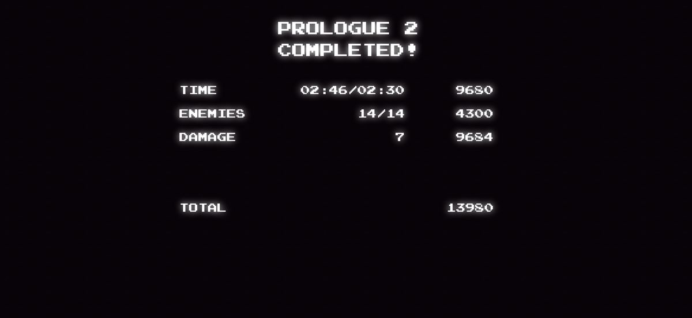

# Client request — proper end-of-stage SCORED TALLY after each RPG boss

**Client, 2026-07-26:** *"I want something like this at the end of each RPG stage
after you defeat a boss. I don't wanna just go onto the next stage — I want an
end-stage summary."*

## The reference



```
                    PROLOGUE 2
                    COMPLETED!

     TIME            02:46/02:30        9680
     ENEMIES               14/14        4300
     DAMAGE                    7        9684

     TOTAL                             13980
```

Classic arcade rank-out. The important structure — this is what makes it feel
like a *reward* rather than a status readout:

1. **Three columns:** `LABEL | achieved/par | POINTS AWARDED`.
2. **Per-metric scoring** — every row pays out its own points.
3. **achieved / par** format so the player instantly sees how they did against a
   target (`02:46/02:30` = ran it in 2:46, par 2:30; `14/14` = every foe cleared).
4. **TOTAL** on its own line after a gap — the sum of the awarded points.
5. Numbers **right-aligned** in fixed columns so they read as a ledger.

---

## What already exists (don't rebuild it)

`showLevelClear()` (index.html ~line 4701) is **already wired and working**:
- fires on boss defeat, sets `GS.ovMode='clear'`, freezes the field
  (`running=false`) so Jandé holds her victory dance behind the overlay;
- reuses `#overlay` / `#ovT` / `#ovM` / `#ovBoard`;
- swaps the primary button to `PROCEED TO STAGE <N> ▶`, hides RESTART;
- handles advance in the `ovMode==='clear'` branch (~line 5017);
- offers the leaderboard name save and banks Grace Notes.

**So the plumbing is done.** This request is a **content + presentation change to
`showLevelClear()`**, not a new screen.

## What's actually missing

Today the board is a **cumulative run status dump** — it shows totals for the
whole run, not what you just did:

```js
bh+='<div class="bd-row"><span>♪ Grace Notes</span><span>'+GS.totalNotes+'</span></div>';  // whole run
bh+='<div class="bd-row"><span>Distance</span><span>'+Math.floor(GS.dist)+'m</span></div>';
bh+='<div class="bd-row"><span>◆ Score</span><span>'+GS.score.toLocaleString()+'</span></div>'; // whole run
```

There is **no per-stage performance, no par comparison, and no per-metric
payout** — which is exactly what the reference is built around.

### Data availability (checked in code)

| Metric | Status |
|---|---|
| **Stage time** | ✅ **free** — `GS.tick` is reset to 0 by `initGS()` (line 849), so stage seconds = `GS.tick/60` |
| **Stage distance** | ✅ free — `GS.dist` also resets per stage (line 853) |
| **Foes defeated this stage** | ❌ **must add** — no kill counter exists |
| **Foes spawned this stage** | ❌ **must add** — needed for the `14/14` denominator |
| **Damage taken this stage** | ❌ **must add** — `GS.hits` exists but isn't a per-stage damage tally |
| **Grace Notes this stage** | ⚠️ `GS.totalNotes` is **cumulative** — needs a per-stage delta |
| **Par time per stage** | ❌ **must add** — a `STAGE_PAR[9]` table |

### Suggested additions
- `GS.kills` — increment in `killFoe`.
- `GS.foesTotal` — increment wherever `genAhead` pushes a foe.
- `GS.dmgTaken` — increment where the player loses a mask/heart.
- `GS.notes0` — snapshot `GS.totalNotes` at `initGS` so stage notes = delta.
- `STAGE_PAR = [...]` — 9 par times. Tune from real playthroughs; `stageEnd=330`
  columns is the natural basis.

All five reset naturally in `initGS()` alongside the existing counters.

---

## Suggested layout (in the game's own voice)

⚠️ **Two binding project rules apply here:**

1. **Music-themed vocabulary is binding** (CLAUDE.md) — so don't ship the literal
   words "ENEMIES/DAMAGE". Use the game's language.
2. **NO STOCK GLYPHS IN GAME UI** (client directive) — and note the *current*
   `showLevelClear` already violates this: it uses `✦ ◈ ♪ ◆ ▶` as visual
   elements. Since this screen is being redesigned anyway, that's a free chance
   to retire them for made assets or plain words.

```
              STAGE I CLEAR
        THE INK WARDEN — SILENCED

  TIME              02:46 / 02:30      9,680
  GRACE NOTES              38 / 44     4,300
  FOES SILENCED            14 / 14     2,800
  UNTOUCHED                      7     9,684
  RESONANCE                    LV 9    1,200

  TOTAL                              27,664
```

- Keep the boss's name in the subtitle — it's the trophy line, and `BOSS_NAME[ai]`
  is already in scope.
- Keep the existing trophies / objectives-multiplier blocks **below** the tally,
  and the `PROCEED TO STAGE <N>` button. Those work; don't disturb them.
- Award points per row, then **`TOTAL` = the sum**, and add that to `GS.score`.
- **Count the total up** rather than printing it — a short roll-up animation is
  most of what makes an arcade tally feel good. Respect
  `SET.reduceMotion` (already in settings) by printing instantly when it's on.

### Layout note
Use a real 3-column grid with `font-variant-numeric: tabular-nums` and
right-aligned numerics so the columns line up. The existing `.bd-row` is a
2-column flex (`<span>` / `<span>`) — it will need a third cell.

---

## Scope
- **Files:** `index.html` only — `showLevelClear()`, `initGS()`, `killFoe`,
  the foe-spawn site in `genAhead`, the player-damage site, plus `.bd-row` CSS.
- **Do not** touch the Royal Runner. This is **RPG-only** — the runner is an
  endless run and has no stage-boss clear.
- Verify in **portrait and landscape** (landscape overlays are already clipping —
  see `docs/LANDSCAPE_FIX_BRIEF.md` #4/#5; this new content is taller, so it
  needs the same short-viewport treatment: the TOTAL and PROCEED button must be
  reachable without scrolling).

---

# PAR TIMES + SCORING — derived spec

Requested by the client as a follow-up. These are **derived starting values, not
guesses** — computed from the stage's own constants — but they still need one
play-test calibration pass (see *Calibration* at the end).

## How the reference scores TIME (reverse-engineered)

The reference row is `TIME  02:46/02:30  9680`. That is **exactly**:

```
10000 − (166s actual − 150s par) × 20  =  10000 − 320  =  9680   ✓
```

So it's a clean **base minus a per-second-over penalty**, not a ratio curve.
Worth matching — it's readable ("every second over costs 20") and it never
produces ugly fractions.

## Derivation

Read straight out of `index.html`:

| Constant | Value | Source |
|---|---|---|
| Stage length | `stageEnd = 330` columns | line 908 |
| Tile size | `T = 32` | line 859 |
| Run speed | `tgt = ±6.4` px/frame @ 60fps = 384 px/s | line 1402 |
| Boss HP | `7 + ai*2`, finale `28` | line 936 |
| Per-stage mix | `gap`, `vert`, `foe`, `haz` | `STAGE_RECIPE` |

**Sprint floor** — a perfect run, no obstacles, no combat:
`330 × 32 ÷ 384 = 27.5s`. Nobody will ever hit this; it's the basis.

**Overhead** — how much each stage's own design slows you down. Weights reflect
the relative cost: jumping a gap costs most, then combat, then climbing, then
hazard caution.

```
overhead = 1.6*gap + 1.15*foe + 0.55*vert + 0.35*haz
travel   = 27.5 * (1 + overhead)
boss     = 6 + bossHP * 1.4          // 6s of gate/intro + ~1.4s per HP
par      = round(travel + boss, to :05)
```

## The table

| # | Stage | overhead | travel | bossHP | boss | **PAR** |
|---|---|---|---|---|---|---|
| 0 | Library | 0.92 | 53s | 7 | 16s | **1:10** |
| 1 | Meadow | 0.86 | 51s | 9 | 19s | **1:10** |
| 2 | Petal Mile | 1.20 | 61s | 11 | 21s | **1:20** |
| 3 | Rose Waltz | 1.42 | 66s | 13 | 24s | **1:30** |
| 4 | Mirror Lake | 1.40 | 66s | 15 | 27s | **1:35** |
| 5 | Wishing Glade | 1.52 | 69s | 17 | 30s | **1:40** |
| 6 | Golden Hour | 1.63 | 72s | 19 | 33s | **1:45** |
| 7 | Sky Gardens | 1.84 | 78s | 21 | 35s | **1:55** |
| 8 | Her Encore | 1.77 | 76s | 28 | 45s | **2:00** |

```js
// seconds; index = stage. Derived from STAGE_RECIPE + stageEnd + run speed.
var STAGE_PAR = [70, 70, 80, 90, 95, 100, 105, 115, 120];
```

The curve rises monotonically (1:10 → 2:00) and tracks the difficulty ramp, so
par tightens exactly where the stage gets harder.

## Par must scale with the difficulty setting

Boss HP already scales `×0.7 / ×1.0 / ×1.4` (line 936). If par doesn't scale too,
**Hard players can never beat par** — they're fighting a boss with 40% more HP
against a Normal clock. Scale par by roughly the resulting run-length change:

```js
var PAR_DIFF = {easy:0.88, normal:1.0, hard:1.18};
function stagePar(ai){ return STAGE_PAR[ai] * (PAR_DIFF[SET.diff]||1); }
```

| # | EASY | NORMAL | HARD |
|---|---|---|---|
| 0 | 1:00 | 1:10 | 1:25 |
| 1 | 1:00 | 1:10 | 1:25 |
| 2 | 1:10 | 1:20 | 1:35 |
| 3 | 1:20 | 1:30 | 1:45 |
| 4 | 1:25 | 1:35 | 1:50 |
| 5 | 1:30 | 1:40 | 2:00 |
| 6 | 1:30 | 1:45 | 2:05 |
| 7 | 1:40 | 1:55 | 2:15 |
| 8 | 1:45 | 2:00 | 2:20 |

## Scoring formulas

Named constants so they stay tunable in one place:

```js
var TALLY = {
  timeBase:10000, timeOver:20, timeUnder:10, timeUnderCap:3000,
  notePts:100,  noteAllBonus:2000,
  foePts:200,   foeAllBonus:1500,
  cleanBase:8000, hitCost:1000,
  resPts:200
};
```

| Row | Formula | Notes |
|---|---|---|
| **TIME** | `10000 − max(0, actual−par)×20`, floored at 0 | matches the reference exactly |
| *(under par)* | `+ min(3000, (par−actual)×10)` | rewards speed without dwarfing everything else |
| **GRACE NOTES** | `collected×100`, `+2000` if `collected === total` | needs the per-stage delta |
| **FOES SILENCED** | `killed×200`, `+1500` if `killed === spawned` | the `14/14` row |
| **UNTOUCHED** | `max(0, 8000 − hits×1000)` | a no-hit clear pays the full 8000 — the headline flex |
| **RESONANCE** | `level×200` | small; rewards leveling, doesn't dominate |
| **TOTAL** | sum of the above | add to `GS.score`, then bank |

Deliberate shape: **TIME and UNTOUCHED are the two big levers** (10k and 8k), so
the tally rewards *playing well*, not just grinding pickups. Collection rows are
meaningful but can't out-earn skill.

## Guard rails

- **Clamp the clock.** If a player pauses, idles, or wanders back for the hidden
  cache, `GS.tick` keeps counting. Either freeze the timer while paused, or cap
  the TIME penalty so a leisurely explorer doesn't score a negative row. Floor at
  0 either way — **never show a negative number**.
- **Backtracking is a feature** (stages are persistent by design, and the
  Wanderer's Map cache rewards exploring). Don't let the clock punish it so hard
  that it discourages the exploration you deliberately built.
- **`GS.tick` is frames**, so `seconds = GS.tick/60`. Format `M:SS`.
- Stage 8 has no "next stage" — the finale tally should read **RUN COMPLETE** and
  lead into the ending, not `PROCEED TO STAGE X`.

## Calibration (the one thing I can't do from here)

These are derived from the movement constants, **not from real playthroughs.**
The formula's weights (`1.6 / 1.15 / 0.55 / 0.35`) are reasoned estimates.

Do one pass: play each stage once at Normal, unhurried but not idling, and log
`GS.tick/60` at boss defeat. Then set `STAGE_PAR[ai]` to about **1.15× that
time** — par should feel achievable on a good clean run and reward a confident
one, not demand a speedrun. If the measured times come in wildly different from
the table, the weights are what to adjust, not the individual numbers — that
keeps the curve internally consistent.
